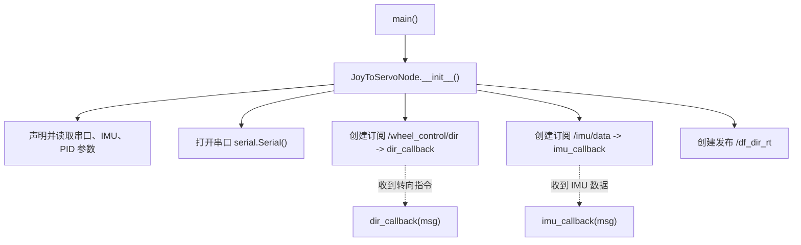
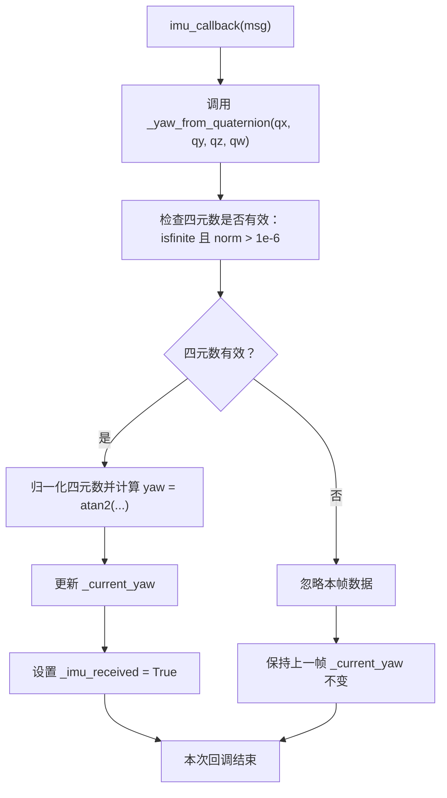
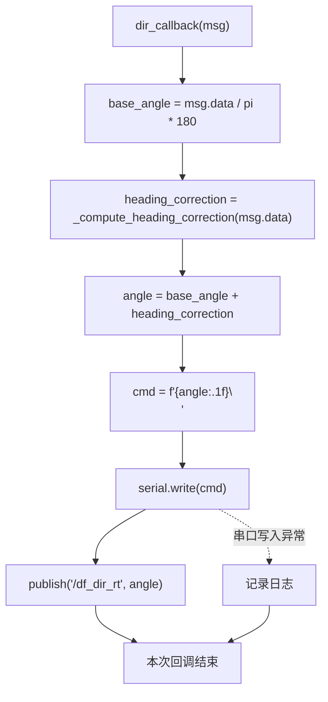
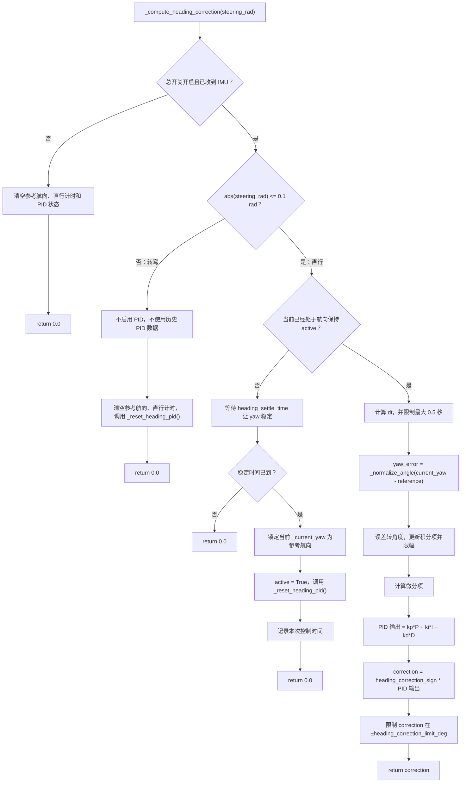

# wheel_dir_pwm.py 执行流程图

本文件说明 `wheel_dir_pwm.py` 中节点初始化、IMU 接收、转向指令处理以及 PID 航向保持的执行顺序。

## 1. 节点初始化与事件分发

## 2. 收到 IMU 数据后的执行流程

## 3. 收到前轮转向指令后的执行流程

## 4. `_compute_heading_correction()` 内部详细流程

## 5. 方法调用关系表

| 触发事件 | 首先执行 | 其次执行 | 说明 |
| --- | --- | --- | --- |
| 收到 IMU 数据 | `imu_callback()` | `_yaw_from_quaternion()` | 从四元数得到 yaw，更新 `_current_yaw` |
| 收到转向指令 | `dir_callback()` | `_compute_heading_correction()` | 计算是否需要叠加 PID 修正 |
| 计算相对偏航 | `_compute_heading_correction()` | `_normalize_angle()` | 把 yaw 误差限制到 `[-pi, pi]` |
| 退出直行/进入转弯 | `_compute_heading_correction()` | `_reset_heading_pid()` | 清除积分、微分和上次时间 |
| 发送舵机指令 | `dir_callback()` | `serial.write()` | 把最终角度发送给舵机 |
| 发布实时转向角 | `dir_callback()` | `pub.publish()` | 发布 `/df_dir_rt` |

## 6. 转弯后再次直行的处理

1. 转弯时：`_heading_control_active` 设为 `False`，参考航向和 PID 历史数据被清空。
2. 再次进入直行时：不会立即锁定参考航向。
3. 先等待 `heading_settle_time` 秒，让车头 yaw 稳定。
4. 稳定后锁定当前 yaw 作为新的参考航向，并重新开始 PID。

这样做的目的是避免把转弯末段的瞬时偏航锁成参考方向。
